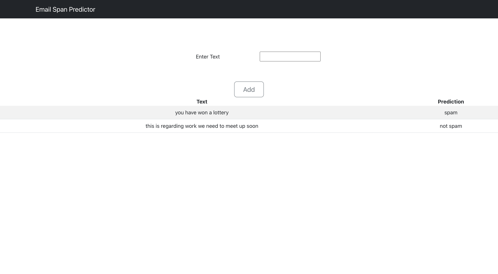

# Email Spam Predictor

In this project I have built a website which can take text as an input and predict if it is a spam or not. For building the model we have used naive bayes algorithm. For the frontend we have used React.js, and for the prediction api we have used flask.

## To run the project

Download the above project and then follow the following steps

1)Go to the frontend folder and type npm install (This will install the required dependencies)
2)Type npm start (This will start the frontend)
3)Go to the prediction_Api folder and then type python app.py (This will start the api)

## Working project pic

